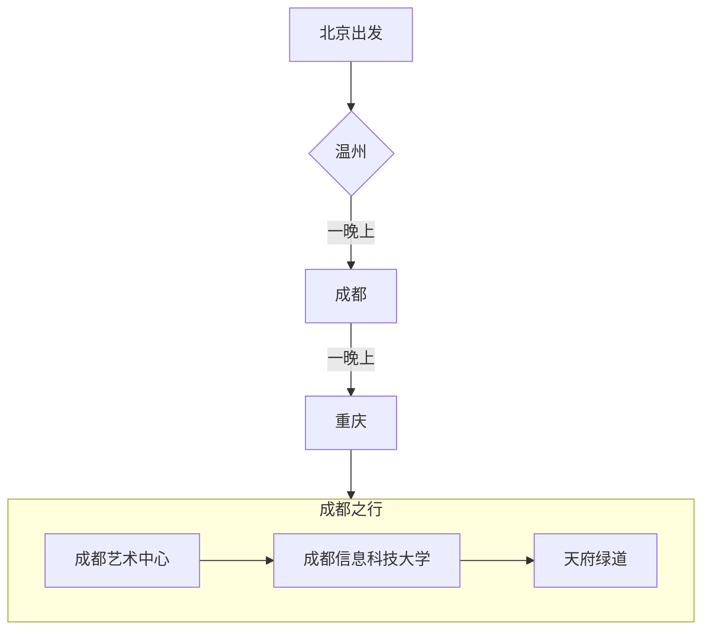

# 行进图
---

- 警告！！！下面图片居多，注意流量
# 温州

我本来计划是直接去成都的，但是看到有机票转机温州。想着我还没去过朋友他们学校，就选了一张转机的机票。
结果当然是玩的很开心
温州医科大建设的是真的很好，楼很漂亮。环境很美，他们的大学城坐落在湿地公园旁边。
我晚上本来想去网吧或者是什么地方过一夜（没有这样的经历还很想尝试
可惜最后还是选择去机场睡了一晚上

飞去温州的路上看窗外晚霞

*温州医科大学体科学馆*

*温州医科大学*

*阿米娅！在此*

*从北京带的黑森林小蛋糕，但到那边已经稀碎了*

*在江畔调酒*

*街边买的小吃，到温州大学楼下吃的，很好吃*

# 重庆

